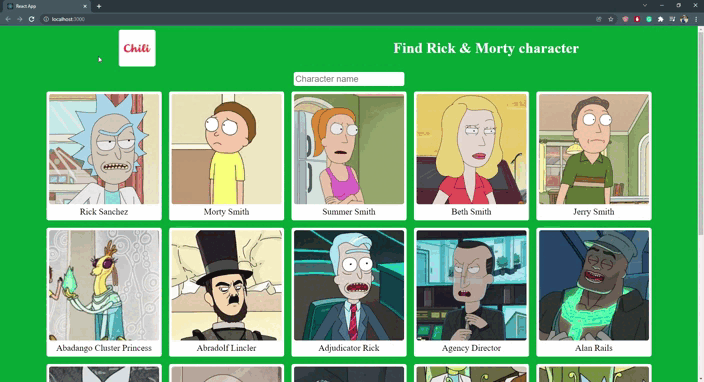

# Character filter app

If you want to check out the page yourself <a href="https://flamboyant-booth-6a2caa.netlify.app/"> click here</a>!

 

## Project Description

This is small project, where you can search for character and the search will work only when you stop writing. If you don't write anything in the search bar for 1 second, it will search for all matching characters.

Project was made with React framework and using styled components to style the page!

About the project:
<ul> 
<li>
The entry point for the project is in App.tsx file
</li>
<li>
All style files except reset file is in the components/style map.
</li>
<li>
In project I use libraries like: react loader spinner, Axios, styled components.
</li>
</ul>

 

## To run my project:

Start with:

### `npm install`

To install all the dependencies.

### `npm start`

Runs the app in the development mode.\
Open [http://localhost:3000](http://localhost:3000) to view it in the browser.

## Optional:

### `npm run build`

Builds the app for production to the `build` folder.\
It correctly bundles React in production mode and optimizes the build for the best performance.

The build is minified and the filenames include the hashes.\
Your app is ready to be deployed!

See the section about [deployment](https://facebook.github.io/create-react-app/docs/deployment) for more information.

 

Hope you enjoy,
Toms 